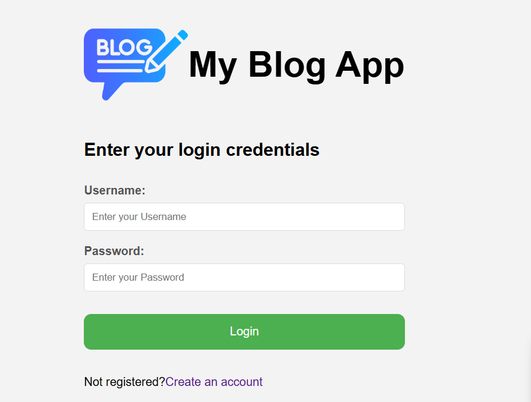
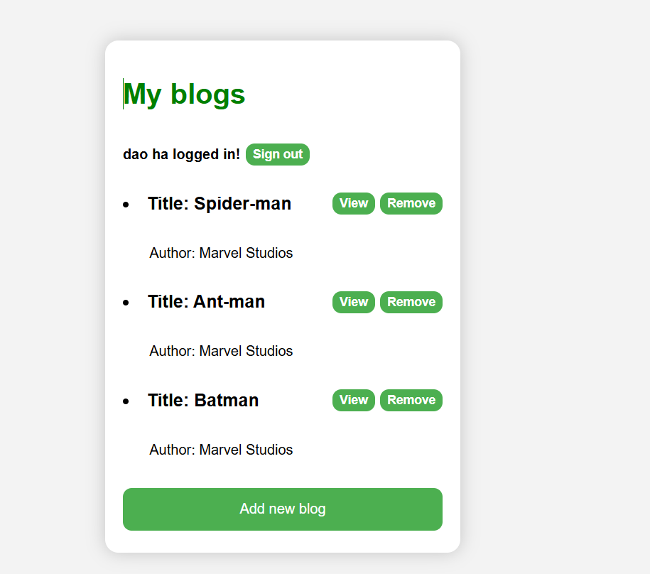
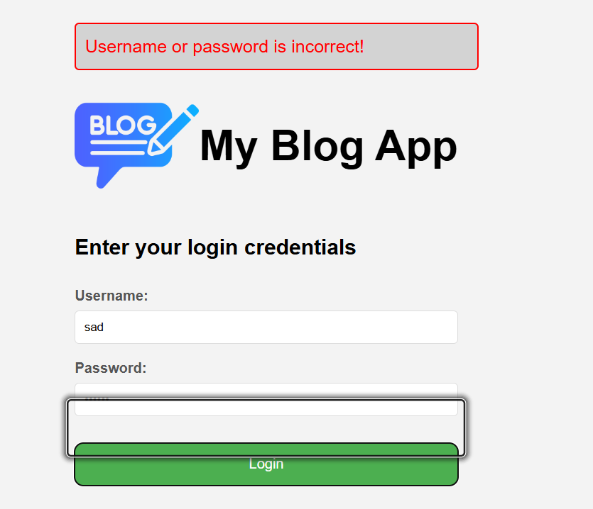
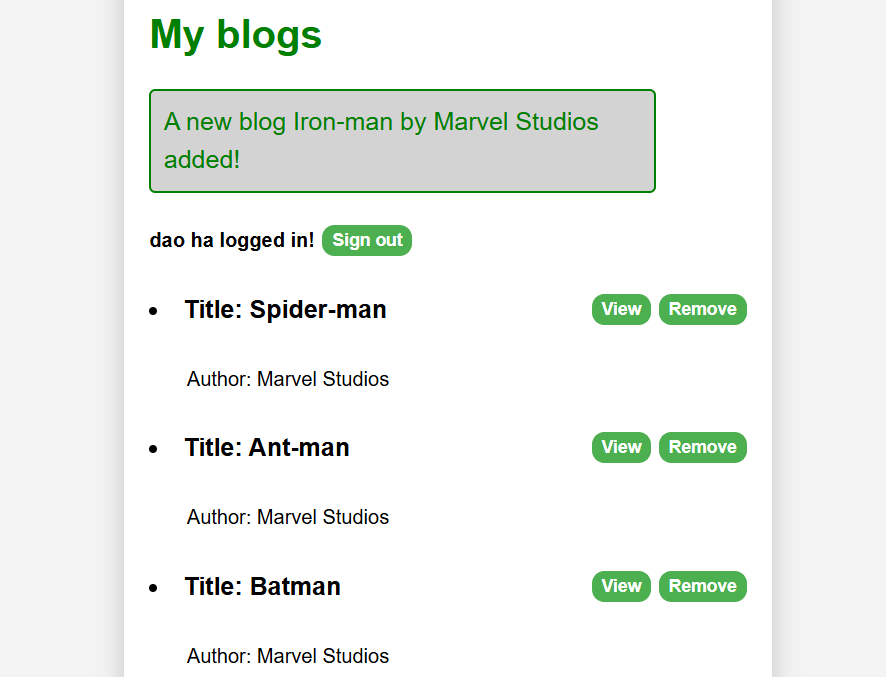
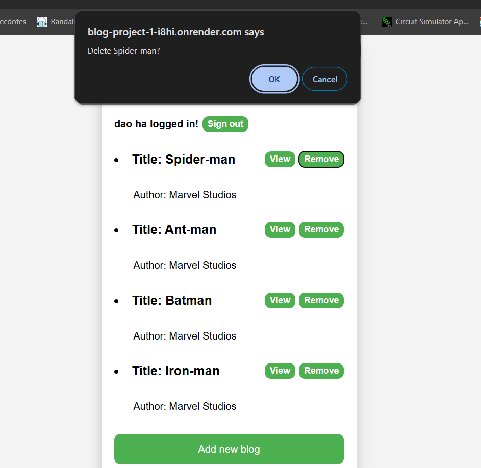
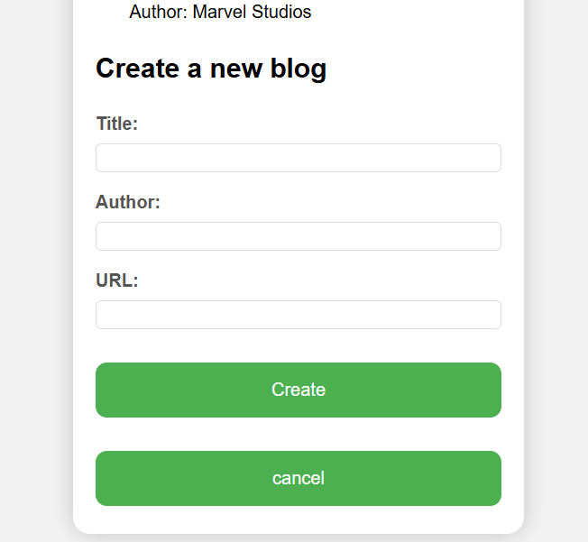

# Blog_project

Link to website
https://blog-project-1-i8hi.onrender.com

Link to the repository of Blog Front-End

# Project Description

## A blog is an online website where individuals regularly publish written content in the form of posts or articles. Blogs serve a variety of purposes and can be used for different reasons, including:

- Sharing Information
- Expressing Ideas and Opinions
- Educating and Informing

## New features:

- User administration
- Token authentication

## Functionalities:

- If a user is not logged in, only the login form is visible.
  

- If the user is logged-in, the name of the user and a list of blogs is shown.
  

- Failed login can show the following notification
  

- Notifications that inform the user about successful and unsuccessful operations at the top of the page
  

- In the homepage, for each blog, you can view the detailed informations of it by clicking view button
- Moreover, you can delete it from the app as well as the database by clicking remove button which trigger a browser dialog to make sure that you want to delete that blog
  

- In addition, I add the "add" functionality where you can add a new blog. By default, add blog form is not shown until you click "add blog" button. You can also click "cancel" button to hide the "add blog form"
  

# Technologies

## Front-end

- Languages:
  - HTML
  - CSS
  - JavaScript
- Framework:
  - ReactJs

## Back-end

- Language:
  - JavaScript
  - Node.js
- Framework:
  - Express.js
  - Mongoose
- Database:
  - MongoDB
